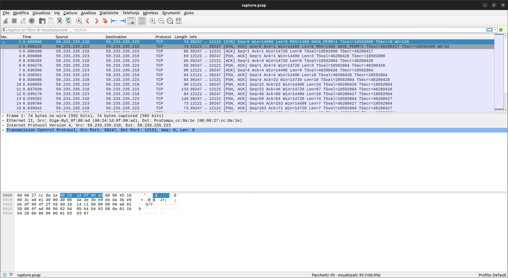
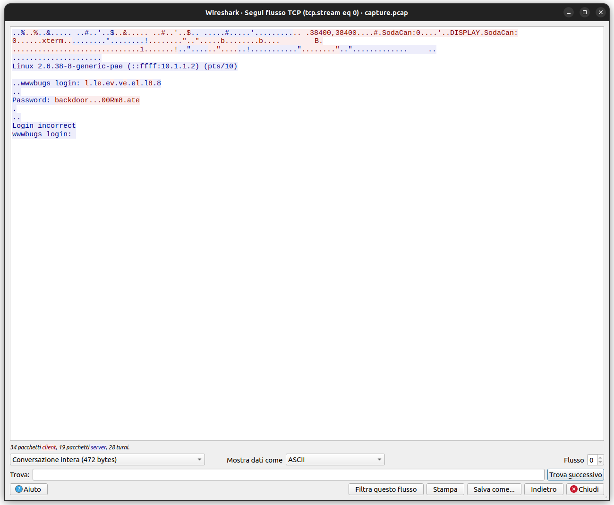
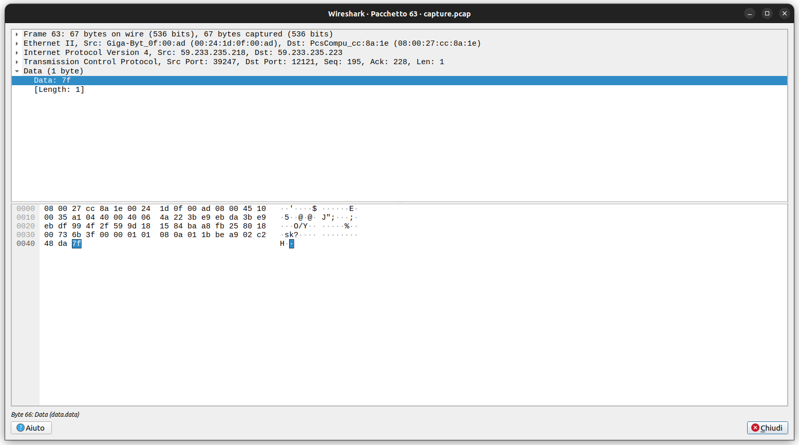

# Level 08

World readable files strike again. Check what that user was up to, and use it to log into **flag08** account.

To do this level, log in as the **level08** account with the password **level08**. Files for this level can be found in /home/flag08.

## Source Code

There is no source code available for this level.

## Writeup

If we go to the **/home/flag08** directory we found this files:

```bash
level08@nebula:/home/flag08$ ll
total 14
drwxr-x--- 2 flag08 level08   86 2012-08-19 03:07 ./
drwxr-xr-x 1 root   root     100 2012-08-27 07:18 ../
-rw-r--r-- 1 flag08 flag08   220 2011-05-18 02:54 .bash_logout
-rw-r--r-- 1 flag08 flag08  3353 2011-05-18 02:54 .bashrc
-rw-r--r-- 1 root   root    8302 2011-11-20 21:22 capture.pcap
-rw-r--r-- 1 flag08 flag08   675 2011-05-18 02:54 .profile
```

Download the **capture.pcap** file with **scp** command:

```bash
scp level08@nebula:/home/flag08/capture.pcap .
```

Now we can open it with **Wireshark** program:

**NB:** to install it use the command `sudo apt install wireshark`

```bash
wireshark capture.pcap
```

This window will should appeare:



We can go to **Statistiche** -> **Gerarchia di protocolli** and see that the TCP byte percent is near 50%, we can suppost that there is a **telnet** session in this capture. Because when a byte of data is sent, a byte of ack is received.
Another fact is the presence of **Data** protocol type. Wireshark use this kind od protocol type when is used a protocol with a non well-known port.

Right click on **Data** protocol and apply the filter on it.

Now right click on the first packet and follow the TCP stream.



We can see a login phase with a password.

But we see dots inside the password. Wireshark use dots when the ascii code of the byte is not printable.

Let's click on the dot and see which ascii code is it:



Is the **\x7f** hex code that is corrispond to **DEL** command.

The user delete a character to write another in this position. We can now build the correct password:

```
backd00Rmate
```

We can now login with this credentials:

```bash
su flag08
```

We are now **flag08**:

```bash
sh-4.2$ id
uid=991(flag08) gid=991(flag08) groups=991(flag08)
```

We can now run **getflag** command:

```bash
sh-4.2$ getflag
You have successfully executed getflag on a target account
```